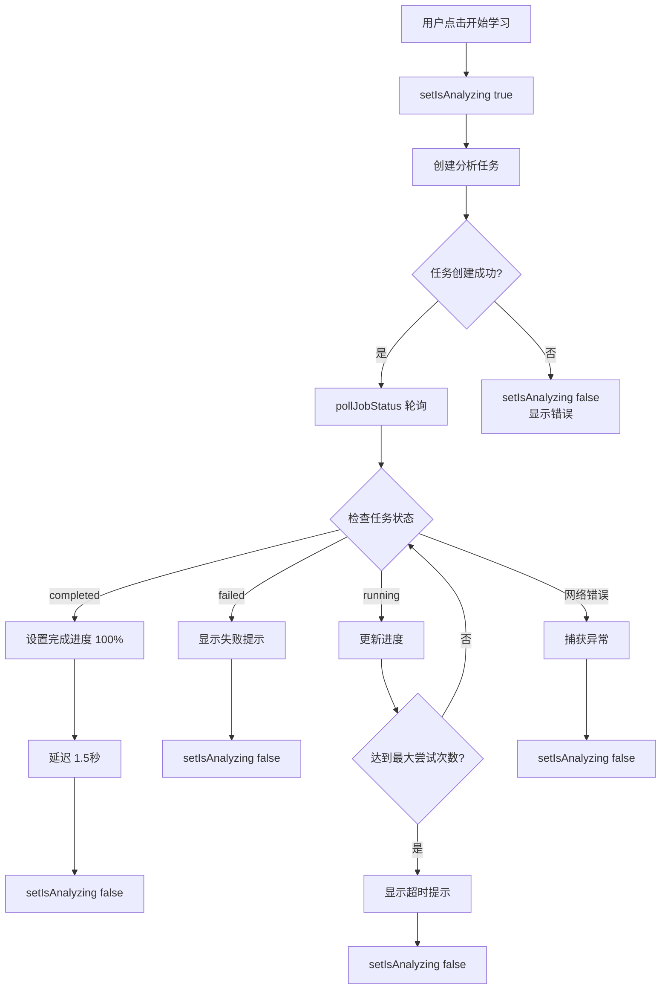

# 进度展示修复说明

## 🐛 问题描述

**症状**: 前端的进度展示"一闪而过"，用户看不到详细的加载进度信息

**原因**: `isAnalyzing` 状态在 `finally` 块中被立即设置为 `false`，导致：
1. `handleAnalyzeVideo` 调用 `pollJobStatus` 是异步的
2. 但 `finally` 块立即执行，关闭了加载状态
3. 进度条还没开始显示就被隐藏了

## ✅ 修复方案

### 1. 移除 `finally` 块中的 `setIsAnalyzing(false)`

**修复前**:
```typescript
try {
  // ... 创建任务
  await pollJobStatus(data.job_id); // 异步操作
} catch (error) {
  // ... 错误处理
} finally {
  setIsAnalyzing(false); // ❌ 立即执行，导致进度条消失
}
```

**修复后**:
```typescript
try {
  // ... 创建任务
  await pollJobStatus(data.job_id); // 异步操作
  // ⚠️ 不在这里关闭 isAnalyzing
} catch (error) {
  // ... 错误处理
  setIsAnalyzing(false); // ✅ 只在出错时关闭
}
// 注释说明不在 finally 中关闭的原因
```

### 2. 在所有完成路径中关闭 `isAnalyzing`

#### a) 单视频完成
```typescript
// 单视频处理完成
console.log('✅ 解析完成，提取到', points.length, '个知识点');

// ✅ 延迟关闭，让用户看到"完成"提示
setTimeout(() => {
  setIsAnalyzing(false);
}, 1500); // 1.5秒后关闭
return true;
```

#### b) 视频序列完成
```typescript
// 自动加载指定的P
await loadPart(result.parts[initialPartIndex], initialPartIndex);

// ✅ 延迟关闭，让用户看到"完成"提示
setTimeout(() => {
  setIsAnalyzing(false);
}, 1500);
return true;
```

#### c) 任务失败
```typescript
} else if (job.status === 'failed') {
  console.error('❌ 任务失败');
  alert('视频分析失败，请重试');
  
  // ❌ 立即关闭加载状态
  setIsAnalyzing(false);
  return true;
}
```

#### d) 任务超时
```typescript
} else {
  // ⏱️ 超时
  console.error('❌ 任务超时');
  alert('视频分析超时，请重试或选择较短的视频');
  setIsAnalyzing(false);
  return true;
}
```

#### e) 网络错误
```typescript
} catch (error) {
  console.error('❌ 检查任务状态失败:', error);
  setIsAnalyzing(false); // 网络错误时关闭
}
```

## 🎯 修复效果

### 修复前
```
用户点击 → 进度条出现 → 立即消失（< 100ms）→ 空白等待 → 突然显示结果
```

### 修复后
```
用户点击 
  ↓
📋 创建任务 (10%)
  ↓
📥 下载视频 (20%)
  ↓
📤 上传视频 (15-30%) ⏱️ 预计 1-3 分钟
  ↓
✍️ 识别内容 (30-70%) ⏱️ 预计 2 分钟
  ↓
🧠 分析内容 (70-85%) ⏱️ 预计 30-60 秒
  ↓
💡 提取知识点 (85-95%) ⏱️ 预计 20-40 秒
  ↓
✅ 完成 (100%) ⏱️ 总耗时 3 分钟 25 秒
  ↓
延迟 1.5 秒（让用户看到完成状态）
  ↓
显示视频和知识点
```

## 📊 状态管理流程



## 🎨 用户体验改进

### 1. 完整的进度反馈
- ✅ 用户可以看到每个处理阶段
- ✅ 每个阶段都有对应的 Emoji 和说明
- ✅ 显示预计剩余时间

### 2. 平滑的状态过渡
- ✅ 进度条平滑增长（transition: 500ms）
- ✅ 完成后延迟 1.5 秒再隐藏，让用户看到成功状态
- ✅ 错误/超时时立即隐藏，快速显示错误提示

### 3. 清晰的错误处理
- ✅ 任务失败：明确提示"视频分析失败，请重试"
- ✅ 任务超时：明确提示"视频分析超时，请重试或选择较短的视频"
- ✅ 网络错误：在 catch 块中捕获并关闭加载状态

## 🔍 测试验证

### 测试场景 1: 正常完成
1. 选择一个短视频（< 5分钟）
2. 点击"开始学习"
3. **预期**: 能看到完整的进度流程
4. **验证**: 最后显示 "✅ 完成 100%" 持续 1.5 秒

### 测试场景 2: 任务失败
1. 后端返回 `status: 'failed'`
2. **预期**: 立即弹出错误提示
3. **验证**: 加载状态被关闭，可以重新尝试

### 测试场景 3: 网络错误
1. 断开网络连接后点击
2. **预期**: 捕获网络错误
3. **验证**: 显示错误提示，加载状态关闭

### 测试场景 4: 任务超时
1. 选择一个超长视频（> 1小时）
2. 等待 5 分钟（maxAttempts * 5秒）
3. **预期**: 显示超时提示
4. **验证**: 加载状态关闭

## 📝 代码变更总结

### 文件修改
- ✅ `src/app/[locale]/(marketing)/video-notes-prototype/page.tsx`
  - 移除 `finally` 块中的 `setIsAnalyzing(false)`
  - 在 4 个完成路径添加 `setIsAnalyzing(false)`
  - 成功完成时延迟 1.5 秒关闭
  - 错误/超时时立即关闭

### 关键改动
```diff
- } finally {
-   setIsAnalyzing(false); // 立即关闭，导致进度条消失
- }

+ // 单视频完成
+ setTimeout(() => {
+   setIsAnalyzing(false);
+ }, 1500);

+ // 任务失败
+ setIsAnalyzing(false);

+ // 任务超时
+ setIsAnalyzing(false);

+ // 网络错误
+ } catch (error) {
+   setIsAnalyzing(false);
+ }
```

## 🚀 后续优化建议

### 短期
1. ✅ 添加"取消"按钮，允许用户中止长时间任务
2. ✅ 完成动画：使用 Confetti 或其他庆祝效果

### 中期
1. 📋 使用 WebSocket 实时推送进度（而不是轮询）
2. 📋 更精确的进度计算（基于实际处理进度）

### 长期
1. 📋 离线支持：失败后自动重试
2. 📋 进度持久化：刷新页面后恢复进度

---

**最后更新**: 2025-11-13
**版本**: 1.0
**修复人员**: AI Assistant

